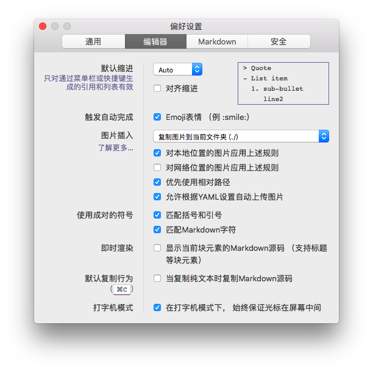
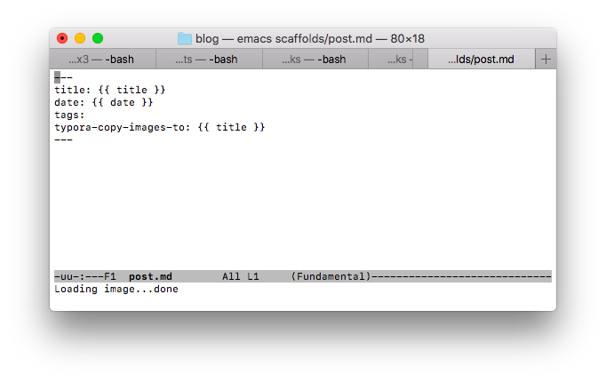

## 开启post_asset_folder选项

编辑_config.yml文件，设置：
`post_asset_folder: true`

## 安装图片自动上传插件

终端中运行如下命令：
`npm install hexo-asset-image --save`

## 设置Typora选项

按如下图设置Typora，选择其中“允许根据YAML设置自动上传图片”的功能

## 修改post、page、draft模版

参考下图，分别添加最后一行代码：

## 完毕！

接下来就是Happy的Writing时间，如果需要插入图片，直接在Typora中`Cmd+V`即可。:)